# CSCI4145 LaaS Project
## Milestone 5 – Proof of Functionality
## Group 2 - Sharebook
Samantha Butler  
Maria Jessen  
Robin Messenger  
Jennifer Protich  
____

## [GET] /login
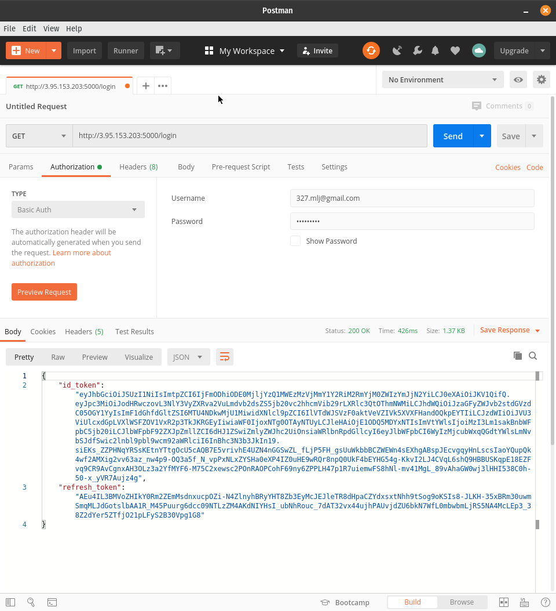
## [POST] /createacccount
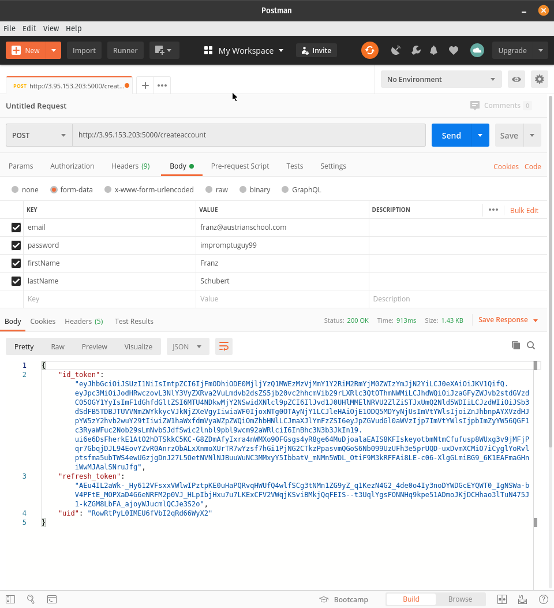
## [GET] /refreshtoken
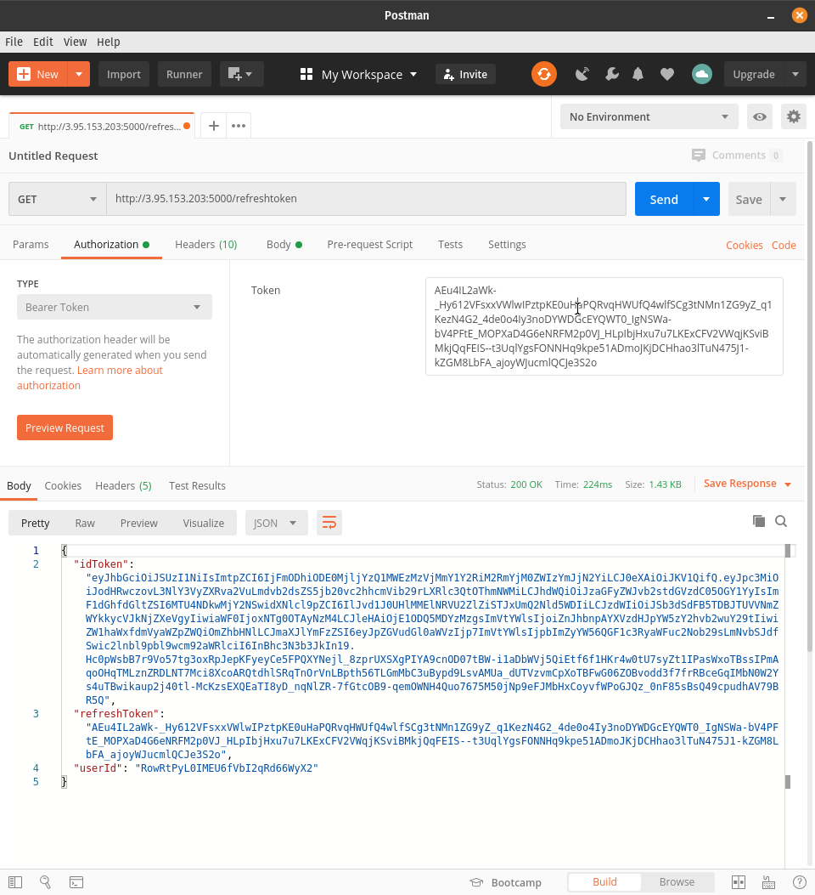
## [GET] /ad
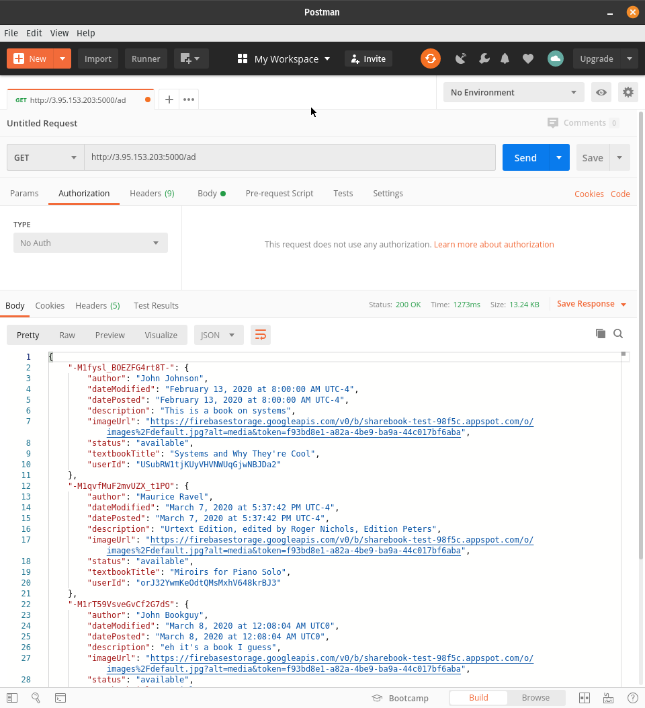
## [POST] /ad
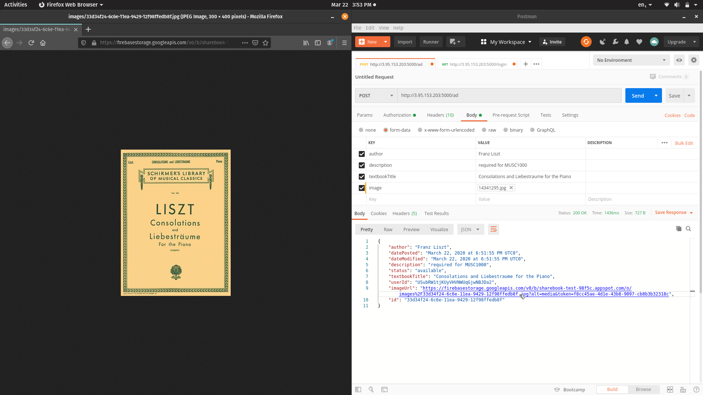
## [GET] /ad/{string:adId}
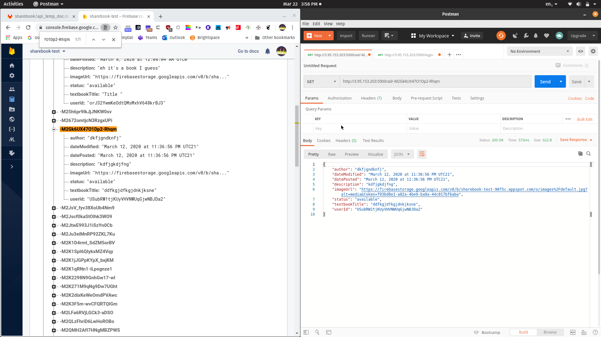
## [PUT] /ad/{string:adId}
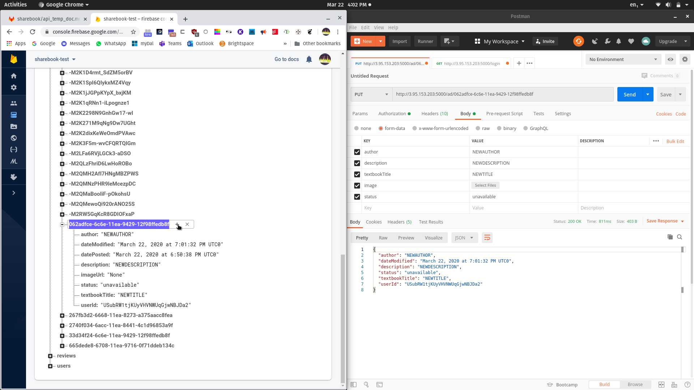
## [DELETE] /ad/{string:adId}
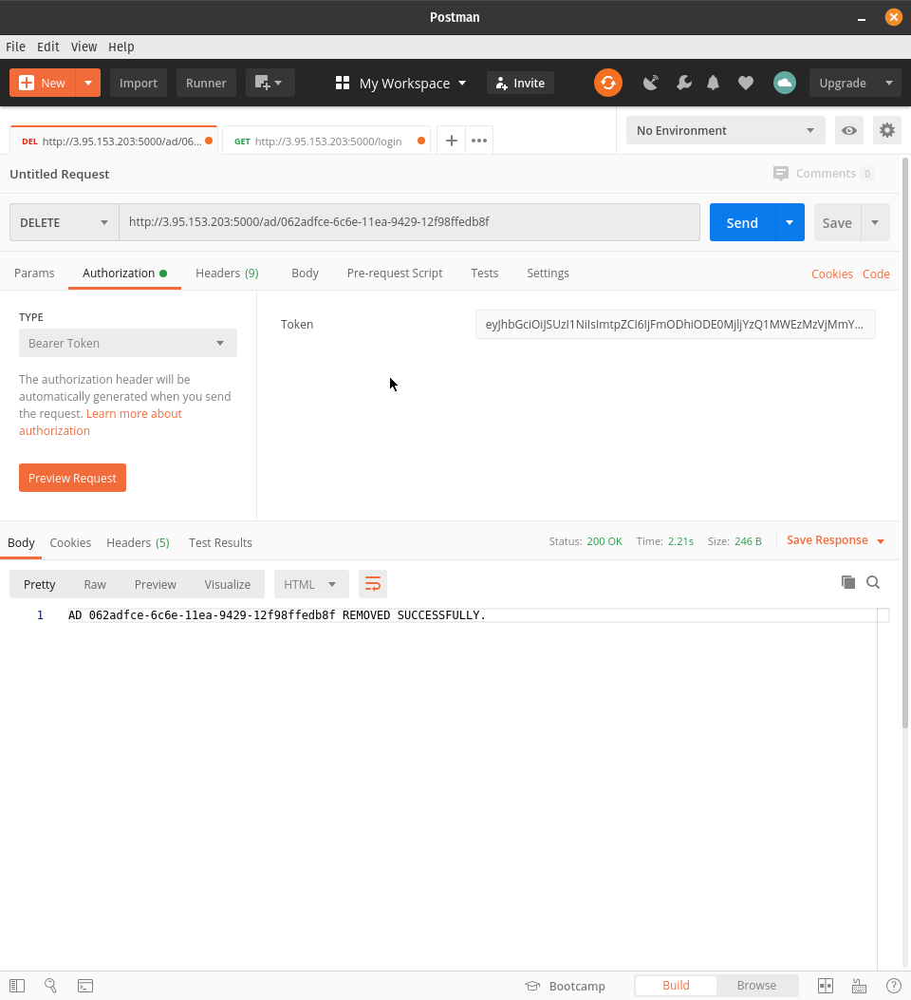
## [GET] /review
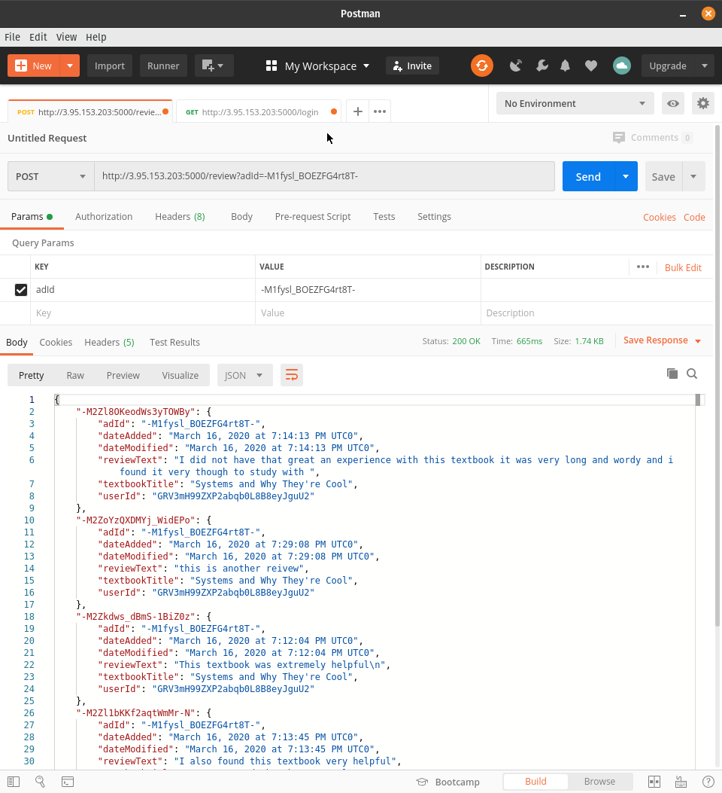
## [POST] /review
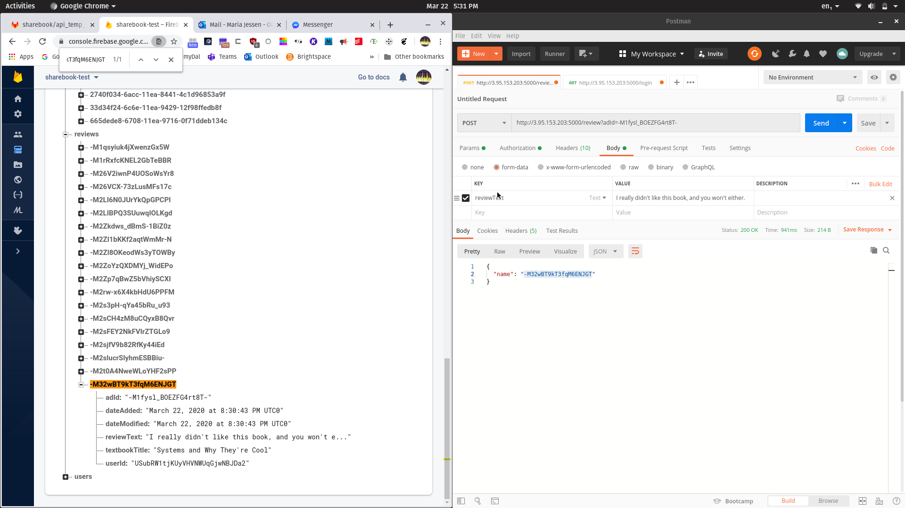
## [GET] /review
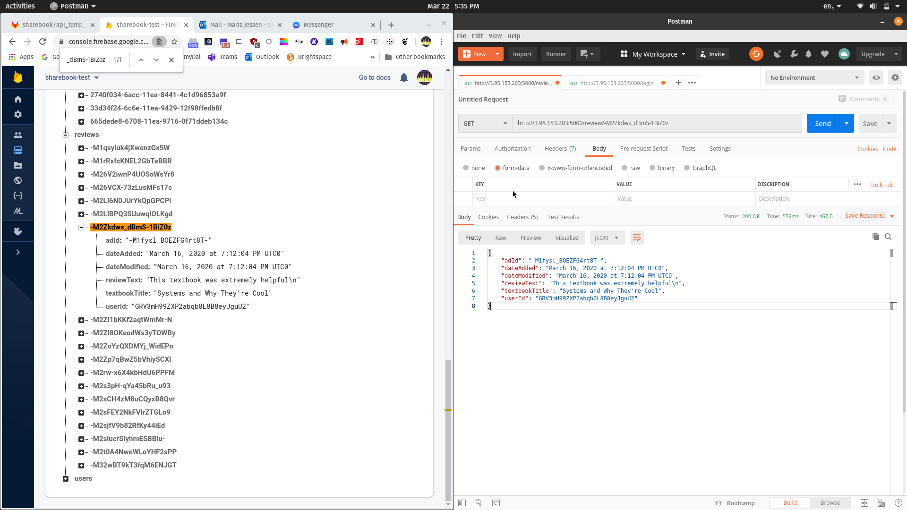
## [PUT] /review

## [DELETE] /review
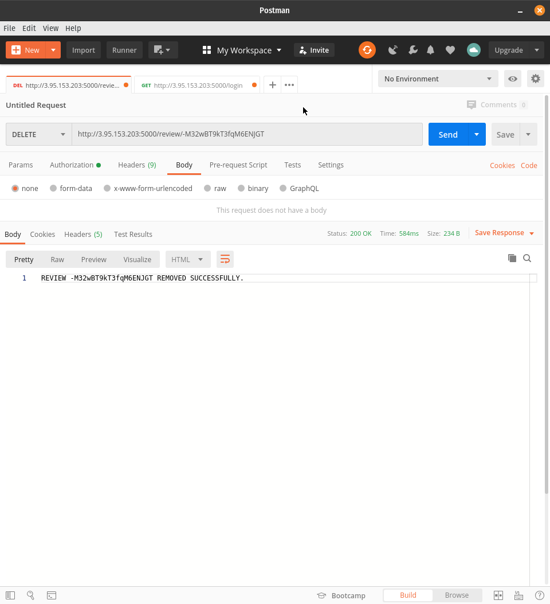
